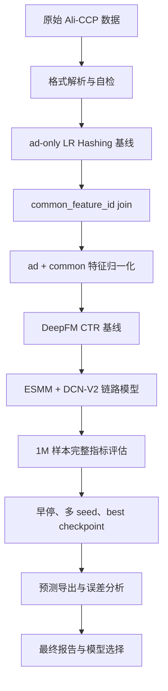

# Ali-CCP 点击与转化预测项目

本项目基于阿里天池 [Ali-CCP: Alibaba Click and Conversion Prediction](https://tianchi.aliyun.com/dataset/408) 数据集，完整构建了一个推荐广告场景下的 `CTR / CVR / CTCVR` 离线建模流程。项目从原始大规模稀疏数据出发，逐步完成数据解析、特征关联、基线建模、深度模型训练、多任务链路建模、指标评估、早停验证、预测导出和误差分析。

项目最终采用 `ESMM + DCN-V2` 作为点击-转化链路模型，并保留 `LR Hashing` 与 `DeepFM` 作为对照基线。

## 1. 项目背景

Ali-CCP 是真实电商推荐链路中的点击与转化预测数据。每条样本以一次曝光为单位，包含：

- 广告侧稀疏特征。
- 用户/上下文公共稀疏特征。
- 点击标签 `click`。
- 转化标签 `conversion`。
- 用于关联公共特征的 `common_feature_id`。

这个项目的重点不只是训练模型，而是解决真实推荐数据中更关键的问题：

- 原始数据不是普通宽表，而是特殊分隔符组织的高维稀疏特征。
- `sample_skeleton` 和 `common_features` 需要通过 `common_feature_id` 关联。
- 点击正例较少，转化正例极少，不能用 `Accuracy` 判断模型好坏。
- 模型不仅要看整体排序能力，还要看 Top-K 样本是否能富集点击和转化。

因此，本项目采用分阶段工程流程，而不是直接训练复杂模型。

## 2. 项目目标

本项目目标分为三层：

1. 建立可靠的数据处理链路，完成 Ali-CCP 稀疏格式解析、`ad + common` 特征 join、稳定切分和特征归一化。
2. 建立可对照的模型体系：`LR Hashing -> DeepFM -> ESMM + DCN-V2`。
3. 基于业务指标判断最终模型：如果只做 CTR 排序，选择 DeepFM；如果做完整点击-转化链路，选择 ESMM + DCN-V2。

核心任务定义：

| 任务 | 含义 | 预测目标 |
| --- | --- | --- |
| CTR | Click Through Rate | 曝光后是否点击 |
| CVR | Conversion Rate | 点击后是否转化 |
| CTCVR | Click-Through & Conversion Rate | 曝光后是否最终转化 |

本项目不使用 `Accuracy` 作为主指标。原因是点击率只有约 4% 到 5%，转化率更低，模型如果全部预测为负类，也能获得很高的 Accuracy，但没有任何业务价值。

## 3. 数据结构

原始数据默认放在本地：

```text
D:\Ali-CCP\sample_train\sample_skeleton_train.csv
D:\Ali-CCP\sample_train\common_features_train.csv
D:\Ali-CCP\sample_test\sample_skeleton_test.csv
D:\Ali-CCP\sample_test\common_features_test.csv
```

`sample_skeleton_*` 每行结构：

```text
sample_id, click, conversion, common_feature_id, ad_feature_count, ad_sparse_features
```

`common_features_*` 每行结构：

```text
common_feature_id, common_feature_count, common_sparse_features
```

稀疏特征分隔符：

| 分隔符 | 含义 |
| --- | --- |
| `\x01` | 特征之间分隔 |
| `\x02` | field 与 feature 分隔 |
| `\x03` | feature 与 value 分隔 |

原始数据和训练产物体积较大，因此 GitHub 仓库只保存代码、配置、轻量报告和指标 JSON，不上传以下目录：

- `sample_train/`
- `sample_test/`
- `processed/`
- `models/`
- `.venv/`
- 大体积预测 CSV 与误差分析 CSV

## 4. 整体技术路线

项目按“先验证数据，再扩大规模，再引入复杂模型”的逻辑推进。



设计原则：

- 先用 `LR Hashing` 验证数据和指标，不直接上深度模型。
- 先跑小样本，再扩大到 100k、500k、1M。
- 先看 CTR，再引入 CVR / CTCVR。
- 用 `AUC`、`PR-AUC`、`LogLoss`、`Lift@K`、校准分桶综合评估。
- 对转化指标保持谨慎，因为 CTCVR 正例非常稀疏。

## 5. 模型方案

| 模型 | 角色 | 主要价值 |
| --- | --- | --- |
| `LR Hashing` | 工程基线 | 快速验证解析、标签、特征尺度和指标是否正常 |
| `DeepFM` | CTR 深度基线 | 同时建模一阶、二阶和高阶稀疏特征交互 |
| `ESMM + DCN-V2` | 最终链路模型 | 同时输出 `pCTR`、`pCVR`、`pCTCVR`，适合点击-转化链路 |

### 为什么选择 ESMM + DCN-V2 作为最终模型

- ESMM 通过 `pCTCVR = pCTR * pCVR` 建模曝光到转化的完整链路。
- CVR tower 不只依赖点击样本训练，能缓解传统 CVR 建模中的样本选择偏差。
- DCN-V2 风格交叉网络适合广告推荐中的高维稀疏交叉特征。
- 在本项目中，ESMM w5 的 CTR 表现接近 DeepFM，同时具备更好的 CTCVR Top-K 富集能力。

### 为什么仍保留 DeepFM

DeepFM 是当前最强的纯 CTR baseline。它训练稳定、概率校准较好，适合作为点击排序模型和 ESMM 的对照组。

## 6. 阶段落地与主要发现

### Stage 01：数据验收与 ad-only 基线

完成内容：

- 实现 Ali-CCP 原始稀疏格式解析器。
- 实现基础数据检查脚本。
- 实现 LR Hashing、DeepFM、ESMM 的最小训练入口。

关键发现：

- 前 1,000 条 skeleton 解析错误为 0。
- common 侧每行特征数很大，后续必须控制特征尺度。
- ad-only 基线只能验证流程，不能代表最终模型效果。

### Stage 02：common feature join 与归一化

完成内容：

- 实现 `selective_join.py` 和 `bucket_join.py`。
- 实现 joined 特征流。
- 对比 `ad-only` 和 `ad + common`。

关键结果：

| 特征方案 | 归一化 | AUC | LogLoss |
| --- | --- | ---: | ---: |
| ad-only | 否 | 0.5046 | 0.1783 |
| ad + common | 否 | 0.4361 | 1.6635 |
| ad-only | 是 | 0.5360 | 0.1774 |
| ad + common | 是 | 0.5834 | 0.1667 |

核心发现：common 特征有效，但必须进行 `value_clip` 和样本级 L2 归一化，否则特征数量过多会导致数值不稳定。

### Stage 03：DeepFM 基线

完成内容：

- 生成 10k 和 100k joined 数据。
- 实现稳定 train/valid 切分。
- 修正 DeepFM embedding 初始化。

100k 关键结果：

| 模型 | CTR AUC | CTR LogLoss |
| --- | ---: | ---: |
| LR Hashing | 0.6107 | 0.1722 |
| DeepFM | 0.6241 | 0.2380 |

核心发现：DeepFM 排序能力超过 LR，说明非线性和特征交叉有效；但 LogLoss 不如 LR，说明概率校准仍可优化。

### Stage 04：ESMM + DCN-V2 500k 训练

完成内容：

- 增加 CTR、CTCVR、CVR-on-clicked 指标。
- 训练 ESMM w1、w5、posw100。
- 与 LR、DeepFM 对比。

500k 关键结果：

| 模型 | CTR AUC | CTR LogLoss | CTCVR AUC | CVR AUC(clicked) |
| --- | ---: | ---: | ---: | ---: |
| LR Hashing | 0.6075 | 0.1813 | - | - |
| DeepFM | 0.6243 | 0.1870 | - | - |
| ESMM w1 | 0.6190 | 0.1890 | 0.5251 | 0.4947 |
| ESMM w5 | 0.6230 | 0.1839 | 0.5345 | 0.4937 |
| ESMM posw100 | 0.5996 | 0.2030 | 0.5547 | 0.4712 |

核心发现：ESMM w5 在 CTR 上接近 DeepFM，posw100 虽然提高 CTCVR AUC，但损伤 CTR 和概率校准。

### Stage 05：1M 样本与完整指标体系

完成内容：

- 扩展到 1M joined 样本。
- 增加 PR-AUC、Lift@K、校准分桶。
- 对 LR、DeepFM、ESMM w5、ESMM posw25 进行正式对比。

1M 数据规模：

| 项目 | 数量 |
| --- | ---: |
| joined rows | 1,000,000 |
| train rows | 799,567 |
| valid rows | 200,433 |
| valid clicks | 9,304 |
| valid conversions | 64 |
| valid CTCVR positives | 62 |

CTR 结果：

| 模型 | CTR AUC | CTR PR-AUC | CTR LogLoss | CTR Lift@1% |
| --- | ---: | ---: | ---: | ---: |
| LR Hashing | 0.6062 | 0.0724 | 0.1891 | 2.81 |
| DeepFM | 0.6200 | 0.0747 | 0.1873 | 2.87 |
| ESMM w5 | 0.6197 | 0.0752 | 0.1921 | 2.93 |
| ESMM posw25 | 0.6183 | 0.0722 | 0.1977 | 2.34 |

CTCVR 结果：

| 模型 | CTCVR AUC | CTCVR PR-AUC | CTCVR LogLoss | CTCVR Lift@1% |
| --- | ---: | ---: | ---: | ---: |
| ESMM w5 | 0.5804 | 0.000800 | 0.003643 | 6.45 |
| ESMM posw25 | 0.5753 | 0.000590 | 0.008045 | 4.84 |

核心发现：DeepFM 是最强纯 CTR 模型；ESMM w5 具有最好的 CTCVR Top-K 效果，更适合作为最终链路模型。

### Stage 06：早停、稳定性和误差分析

完成内容：

- 给 `train_torch.py` 增加 `seed` 控制。
- 增加每 epoch 验证。
- 增加 early stopping 和 best checkpoint 保存。
- 导出 valid 预测分数。
- 生成高分误判和低分漏判样本。

seed2025 关键结果：

| 模型 | CTR AUC | CTR PR-AUC | CTR LogLoss | CTR Lift@1% | CTCVR Lift@1% |
| --- | ---: | ---: | ---: | ---: | ---: |
| DeepFM Early Stop | 0.6299 | 0.0773 | 0.1835 | 2.69 | - |
| ESMM w5 Early Stop | 0.6157 | 0.0745 | 0.1945 | 3.18 | 6.45 |

误差分析发现：

- DeepFM 概率校准更好，适合作为 CTR 模型。
- ESMM w5 的 Top 1% 样本更能富集点击和转化链路目标。
- 高分未点击样本可能来自曝光噪声或用户注意力缺失。
- 低分已点击样本说明模型仍漏掉部分用户/广告组合。
- 低 pCTCVR 但实际转化的样本最值得后续分析，因为它们代表转化漏召回。

## 7. 最终结论

最终选择取决于业务目标：

| 业务目标 | 推荐模型 | 理由 |
| --- | --- | --- |
| 纯 CTR 排序 | `DeepFM seed2025` | CTR AUC、PR-AUC、LogLoss 综合最好 |
| 点击-转化完整链路 | `ESMM + DCN-V2 w5` | CTR 接近 DeepFM，同时输出 pCTR/pCVR/pCTCVR，CTCVR Lift@1% 最好 |

本项目最终推荐模型为：`ESMM + DCN-V2 w5`。

但报告中必须明确：`DeepFM` 是最强 CTR baseline，`ESMM + DCN-V2 w5` 是更符合完整业务链路目标的最终模型。

## 8. 指标解释

| 指标 | 作用 | 本项目中的意义 |
| --- | --- | --- |
| AUC | 衡量正负样本排序能力 | 判断模型整体排序是否优于随机 |
| PR-AUC | 衡量稀疏正例识别能力 | 比 AUC 更适合点击/转化稀疏场景 |
| LogLoss | 衡量概率预测质量 | 判断模型输出概率是否可信 |
| Lift@K | 衡量 Top-K 样本富集能力 | 最贴近推荐排序业务价值 |
| 校准分桶 | 比较预测概率和真实发生率 | 判断模型能否用于概率解释和阈值决策 |

为什么不用 Accuracy：点击和转化极度不均衡，Accuracy 会被大量负样本主导，不能反映推荐模型是否真的能找出高价值样本。

## 9. 项目目录说明

```text
D:\Ali-CCP
├── configs/                  # 数据路径和模型默认参数
├── reports/                  # 阶段报告、轻量指标 JSON、分析摘要
├── scripts/                  # 自检脚本
├── src/                      # 核心源码
├── FINAL_ANALYSIS.md         # 完整项目报告
├── PROJECT_CHECKLIST.md      # 分阶段自检清单
├── PROJECT_STRUCTURE.md      # 文件夹和子文件说明
├── README.md                 # GitHub 项目首页
├── requirements.txt          # Python 依赖
└── .gitignore                # 排除大数据和模型产物
```

未上传但本地存在的重要目录：

```text
D:\Ali-CCP\sample_train\       # 原始训练数据，约数十 GB
D:\Ali-CCP\sample_test\        # 原始测试数据
D:\Ali-CCP\processed\          # joined 数据、中间切分数据
D:\Ali-CCP\models\             # PyTorch checkpoint
D:\Ali-CCP\.venv\              # 本地虚拟环境
```

## 10. 核心文件说明

### 配置文件

| 文件 | 作用 |
| --- | --- |
| `configs/data_config.json` | 数据根目录、train/test 文件相对路径、输出目录等 |
| `configs/model_config.json` | LR、DeepFM、ESMM + DCN-V2 默认参数 |

### 数据处理代码

| 文件 | 作用 |
| --- | --- |
| `src/data/ali_ccp_format.py` | 解析 skeleton、common、joined 行，是数据链路基础 |
| `src/data/feature_stream.py` | 稳定 hash、value clipping、L2 归一化、特征流生成 |
| `src/data/inspect.py` | 数据验收，统计解析错误、点击率、转化率、特征数 |
| `src/data/selective_join.py` | 选择性 join，适合 1k 到 1M 实验规模 |
| `src/data/bucket_join.py` | 分桶 join，面向更大规模或全量 join |
| `src/data/split_joined.py` | 按 sample_id hash 稳定切分 train/valid |
| `src/data/torch_dataset.py` | PyTorch 流式数据集，供 DeepFM 和 ESMM 使用 |

### 模型与训练代码

| 文件 | 作用 |
| --- | --- |
| `src/baselines/lr_hashing.py` | 在线 Logistic Regression + Hashing Trick 基线 |
| `src/models/deepfm.py` | DeepFM CTR 模型 |
| `src/models/esmm_dcnv2.py` | ESMM + DCN-V2 多任务链路模型 |
| `src/train/metrics.py` | AUC、PR-AUC、LogLoss、Lift、校准分桶等统一指标 |
| `src/train/train_lr_hashing.py` | LR Hashing 快速训练入口 |
| `src/train/train_lr_hashing_eval.py` | LR Hashing train/valid 正式评估入口 |
| `src/train/train_torch.py` | DeepFM / ESMM 主训练脚本，支持 seed、early stopping、checkpoint |
| `src/train/export_predictions.py` | 从 checkpoint 导出 valid 预测分数 |
| `src/train/analyze_predictions.py` | 预测结果指标复算、校准分析和错误样本导出 |

### 文档与报告

| 文件 | 作用 |
| --- | --- |
| `FINAL_ANALYSIS.md` | 项目完整报告，包含背景、目标、流程、结果、分析和总结 |
| `PROJECT_CHECKLIST.md` | 分阶段可自检清单，用于复现和纠错 |
| `PROJECT_STRUCTURE.md` | 详细解释每个文件夹和关键文件用途 |
| `reports/stage_*_self_check.md` | 各阶段落地、自检、发现和结论 |
| `reports/*.json` | 各实验指标、history、best metrics、校准分桶 |

## 11. 快速开始

### 1. 安装依赖

```powershell
cd D:\Ali-CCP
python -m venv .venv
.\.venv\Scripts\Activate.ps1
pip install -r requirements.txt
```

依赖列表：

```text
numpy
scikit-learn
torch
tqdm
```

如果系统 `python` 不在 `PATH`，请换成你本机实际 Python 路径运行命令。

### 2. 解析器自检

```powershell
python scripts\self_check.py
```

期望输出：

```text
self_check: ok
```

### 3. 数据验收

```powershell
python -m src.data.inspect --data-root D:\Ali-CCP --split train --max-lines 100000
```

### 4. 训练 LR Hashing 快速基线

```powershell
python -m src.train.train_lr_hashing --data-root D:\Ali-CCP --max-lines 100000 --hash-size 262144
```

### 5. 构建 1M joined 数据

```powershell
python -m src.data.selective_join --data-root D:\Ali-CCP --max-skeleton-lines 1000000 --output D:\Ali-CCP\processed\joined_stage05_1m\joined_train.csv
```

### 6. 切分 train/valid

```powershell
python -m src.data.split_joined --input D:\Ali-CCP\processed\joined_stage05_1m\joined_train.csv --train-output D:\Ali-CCP\processed\joined_stage05_1m\train.csv --valid-output D:\Ali-CCP\processed\joined_stage05_1m\valid.csv --report-output D:\Ali-CCP\reports\stage_05_split_1m.json
```

### 7. 训练 DeepFM

```powershell
python -m src.train.train_torch --model deepfm --feature-source joined --train-path D:\Ali-CCP\processed\joined_stage05_1m\train.csv --valid-path D:\Ali-CCP\processed\joined_stage05_1m\valid.csv --epochs 10 --seed 2025
```

### 8. 训练 ESMM + DCN-V2

```powershell
python -m src.train.train_torch --model esmm_dcnv2 --feature-source joined --train-path D:\Ali-CCP\processed\joined_stage05_1m\train.csv --valid-path D:\Ali-CCP\processed\joined_stage05_1m\valid.csv --epochs 10 --seed 2025 --ctcvr-loss-weight 5
```

具体参数请以 `src/train/train_torch.py` 中 argparse 定义为准。

## 12. 推荐阅读顺序

如果只是了解项目：

1. `README.md`
2. `FINAL_ANALYSIS.md`
3. `PROJECT_STRUCTURE.md`
4. `PROJECT_CHECKLIST.md`

如果要复现实验：

1. `scripts/self_check.py`
2. `src/data/ali_ccp_format.py`
3. `src/data/selective_join.py`
4. `src/data/split_joined.py`
5. `src/train/train_lr_hashing_eval.py`
6. `src/train/train_torch.py`
7. `src/train/export_predictions.py`
8. `src/train/analyze_predictions.py`

如果要看最终实验结果：

1. `reports/stage_05_self_check.md`
2. `reports/stage_06b_self_check.md`
3. `reports/stage_06c_self_check.md`
4. `reports/stage_06b_deepfm_1m_seed2025.json`
5. `reports/stage_06b_esmm_w5_1m_seed2025.json`

## 13. 当前局限

- 尚未进行全量训练，当前重点实验扩展到 1M joined 样本。
- CTCVR 正例仍然较少，转化相关指标对随机种子敏感。
- 多 seed 验证还不完整，目前主要补充了 seed2025。
- 尚未做 field-level 特征消融，无法精确解释每类特征贡献。
- 当前是离线训练与分析项目，尚未封装线上推理服务。

## 14. 后续优化方向

- 补充 `seed=2026` 等多随机种子实验，验证 ESMM 稳定性。
- 扩展到 2M 或更多 joined 样本，提高转化正例数量。
- 对 ESMM 的 loss weight、embedding dim、DCN cross layer 做小范围搜索。
- 加入 field-level ablation，分析广告侧、用户侧、上下文侧特征贡献。
- 增加概率校准方法，例如 Platt Scaling 或 Isotonic Regression。
- 生成可视化图表：Lift 曲线、PR 曲线、校准曲线、模型对比柱状图。
- 封装推理脚本，输出 `sample_id, pCTR, pCVR, pCTCVR`。

## 15. 项目总结

本项目从真实大规模稀疏推荐数据出发，完整走通了点击与转化预测建模流程。项目最大的价值不是单个模型分数，而是建立了一个可复现、可对照、可解释的工程化分析路径：

- 用 `LR Hashing` 作为低成本工程基线。
- 用 `DeepFM` 建立强 CTR 对照模型。
- 用 `ESMM + DCN-V2` 建立最终点击-转化链路模型。
- 用 `AUC / PR-AUC / LogLoss / Lift@K / 校准分桶` 综合判断模型，而不是依赖 Accuracy。
- 用阶段自检、早停、预测导出和误差分析持续纠错。

最终结论：`DeepFM` 是当前最强 CTR baseline，`ESMM + DCN-V2 w5` 是更符合完整业务链路目标的最终推荐模型。
